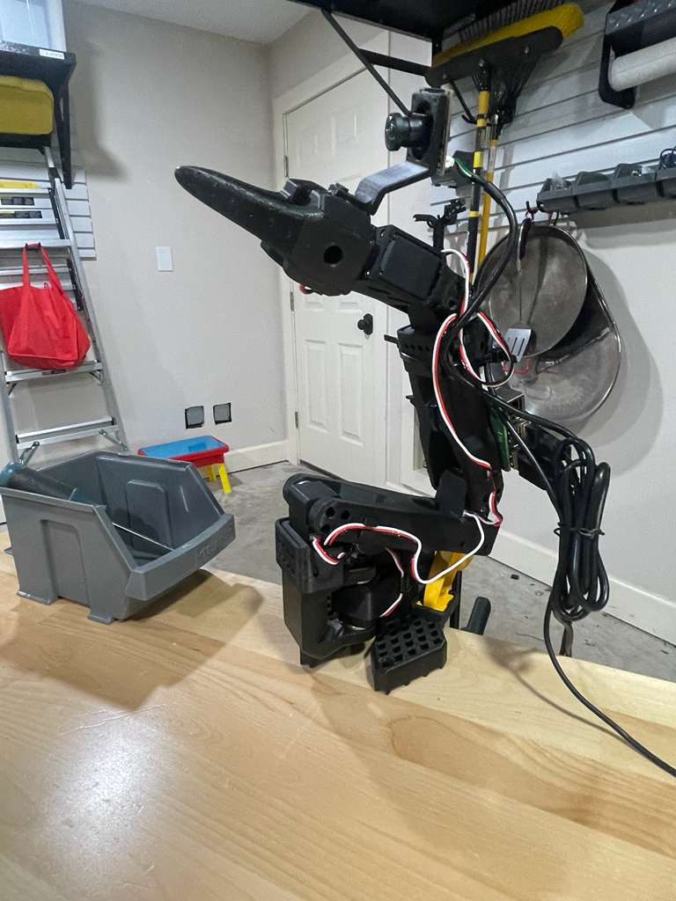
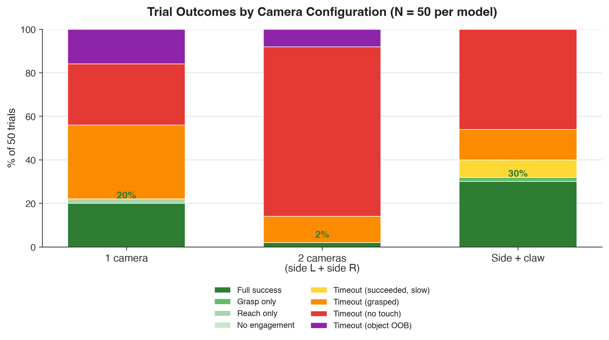

<div align="center">

# V1 — LeRobot SO-101: Learning by Demonstration with SmolVLA

**Teaching a low-cost robotic arm to pick and place, purely from human demonstration —
and honestly reporting what worked and what didn't across three camera configurations.**

[](LICENSE)
[](https://github.com/huggingface/lerobot)
[](https://huggingface.co/blog/smolvla)
[](https://huggingface.co/datasets/cons909/V1-LeRobot-SO101-Eval-Videos)

</div>

---

A pick-and-place task (screwdriver → gray bin) taught to a low-cost SO-101 robotic arm through
imitation learning, using HuggingFace's [LeRobot](https://github.com/huggingface/lerobot)
framework and the [SmolVLA](https://huggingface.co/blog/smolvla) vision-language-action policy.
This is **V1**: three camera configurations were built, trained, and evaluated under one
pre-registered protocol. This repo documents what was tried and what actually happened — it does
not try to improve on those results.

<div align="center">

</div>

## Contents

- [Goal](#goal)
- [Hardware setup](#hardware-setup)
- [The three configurations](#the-three-configurations)
- [Evaluation methodology](#evaluation-methodology)
- [Results](#results)
- [Sample videos](#sample-videos)
- [What I learned](#what-i-learned)
- [Challenges along the way](#challenges-along-the-way)
- [What's next (V2)](#whats-next-v2)
- [How to run this](#how-to-run-this)
- [Repo structure](#repo-structure)
- [License](#license)

## Goal

Teach a robotic arm to pick up a screwdriver from a table and place it in a gray bin, purely from
human teleoperation demonstrations (no scripted motion, no classical planning) — then compare
three different camera setups honestly, with a real evaluation protocol and real data, not just
a demo reel of the best runs.

## Hardware setup

- **Arm:** SO-101 leader/follower pair, Feetech STS3215 servos.
- **Compute:** a Raspberry Pi handles the arm and cameras; a Mac runs SmolVLA inference and sends
  actions to the Pi over a ZMQ socket. The Pi is physically mounted on the back of the robot
  (cable-length constraint), and the side-camera mounts were hand-built to keep the cameras
  rigid between trials.
- **Cameras:** Logitech C920s, in three configurations (see below).
- **Training hardware:** all three checkpoints were trained on the same MacBook M4, no dedicated
  GPU.

## The three configurations

Each configuration's dataset is 80 teleoperated demonstrations, roughly 17–19 seconds each — so
each dataset represents about 24 minutes of raw demonstration time.

| Config | Cameras | Demonstrations | Checkpoint step | Notes |
|---|---|:-:|:-:|---|
| **1 camera** | Single left-side camera | 80 | 20,000 | Simplest setup; least visual context. |
| **2 cameras** ("side left + side right") | Two side-mounted cameras | 80 | 50,000 | Internally the checkpoint's input feature keys are literally named `front`/`side` (that's what the trained model expects — a code-level detail, not a placement description). Started as a claw-mounted camera + one side camera; the claw camera was permanently swapped out mid-project for a second side camera, so this became genuinely two side views. |
| **Side + claw** | One side camera + one claw-mounted camera | 80 | 20,000 | Subjectively the most capable of the three during earlier hand-testing, despite added latency from the claw camera's mount. |

**Checkpoint steps differ across configs** (20k / 50k / 20k) — this is disclosed, not
normalized away. Each model is evaluated at its best available checkpoint from actual training,
not at an artificially matched step count. See
[`docs/EVALUATION_PROTOCOL.md`](docs/EVALUATION_PROTOCOL.md).

## Evaluation methodology

Full pre-registered protocol: [`docs/EVALUATION_PROTOCOL.md`](docs/EVALUATION_PROTOCOL.md).
Summary:

- **N = 50 trials per model** (150 total), object position varied naturally across trials
  (not fixed/memorized), same physical setup and operator throughout.
- **Graded live**, in the moment a trial ends, using a fixed rubric decided in advance —
  never adjusted after the fact.
- Trials that hit the 180s timeout are graded on a separate, reduced timeout rubric rather than
  forced into the normal outcome categories (a stalled attempt and a wrong-but-decisive one are
  different failure modes).
- Safety-clamp events (the arm's built-in per-joint safety limiter overriding a requested action)
  are logged as a continuous per-trial count, not a pass/fail outcome.
- This is a modest sample size — results are reported as directional evidence, not a
  statistically significant claim.

The harness that ran all 150 trials: [`harness/`](harness/). The Pi-side servers it talked to:
[`pi_servers/`](pi_servers/). Full build/debugging history (every bug, a real motor-overheating
safety incident, and the camera hardware troubleshooting) is in
[`docs/EVAL_HARNESS_DESIGN.md`](docs/EVAL_HARNESS_DESIGN.md).

## Results

<div align="center">

</div>

Each bar is one camera configuration, stacked to 100% of its 50 trials, reading bottom to top:

- **green — `full_success`**: object grasped and placed in the bin (exact % labeled on the bar).
- **yellow — `timeout_success_slow`**: got the job done, but not before the 180s clock ran out.
- **orange — `timeout_grasped`**: touched or grasped the object within 180s, but didn't finish.
- **red — `timeout_no_touch`**: never engaged the object at all before timing out.
- **purple — `timeout_object_oob`**: the object ended up out of the arm's reach.

Taller green = more full successes. A bar dominated by red means that config mostly never engaged
the object in the first place — exactly what happened to the 2-camera config (78% `timeout_no_touch`),
versus side + claw, which reaches nearly to full green before hitting mostly orange/red. Full
definitions for every category are in [`docs/EVALUATION_PROTOCOL.md`](docs/EVALUATION_PROTOCOL.md).

Full per-trial data: [`results/`](results/README.md) (`trial_log.csv` per model,
[`results/SUMMARY.txt`](results/SUMMARY.txt) for the generated tables). All 150 trial videos
(not just the samples below) are archived on Hugging Face Hub:
**[cons909/V1-LeRobot-SO101-Eval-Videos](https://huggingface.co/datasets/cons909/V1-LeRobot-SO101-Eval-Videos)**.

| Model | N | Full success | Mean time (all trials) | Mean time (successes) | Clamps/trial | Loop latency |
|---|:-:|:-:|:-:|:-:|:-:|:-:|
| 1 camera | 50 | 10/50 (20%) | 158.4s | 73.5s | 620.92 | 97ms |
| 2 cameras (side left + side right) | 50 | 1/50 (2%) | 178.2s | 84.7s | 388.80 | 160ms |
| **Side + claw** | 50 | **15/50 (30%)** | 149.0s | 83.6s | **1.64** | 253ms |

Side + claw had the highest full-success rate and by far the fewest safety-clamp events, despite
the highest average loop latency — consistent with earlier hand-testing impressions that it was
the most capable of the three, even with the extra lag from the claw camera's mount. The 2-camera
config's near-total shift toward `timeout_no_touch` (78% of its trials) stands out as its
dominant failure mode — it rarely engaged the object at all, rather than engaging and failing
partway through.

**A confound worth stating plainly:** checkpoint steps differ across configs (20k / 50k / 20k),
so camera placement and training duration are not independently tested here. The 2-camera config
trained 2.5x longer than the other two and still finished last, which is the opposite of what
"more training, better result" would predict — and that's worth taking seriously rather than
explaining away. A few concrete, real possibilities for why the 2-camera checkpoint could be worse
*because* of the extra training, not despite it:

- **Overfitting to the 80 training demonstrations.** V1 has no held-out validation split (see
  [`docs/EVALUATION_PROTOCOL.md`](docs/EVALUATION_PROTOCOL.md) §7) — nothing here would have
  caught the policy memorizing training-specific motion instead of generalizing, and 50k steps is
  more opportunity for that to happen than 20k.
- **A longer run without early stopping can drift past its best point.** Imitation learning on a
  small dataset is known to get worse on real deployment even as training loss keeps falling —
  it's possible the 2-camera checkpoint's best moment was earlier than 50k and this evaluation
  simply didn't catch it.
- **Two camera inputs is a materially bigger input space than one or two-well-placed cameras**,
  and might need more (or differently scheduled) training to use well — so "2.5x the steps" may
  not mean "2.5x as trained" in any comparable sense across configs.

None of this rules out the opposite explanation — that camera placement really is the dominant
factor and training length is incidental — and this evaluation has no way to tell those apart.
That's exactly the point: this result can't cleanly separate "this camera placement is worse"
from "something about this specific training run was worse," so reporting "placement seems to
matter more than camera count" as this evaluation's headline finding is a claim this data can
suggest, not one it can fully defend. Isolating that — same hardware, same training budget, only
the camera setup changing — is exactly the single-variable test V2 is designed to run.

The safety-clamp counts deserve more than a table cell, too. 1-camera and 2-camera averaged
620.92 and 388.80 clamp events per trial; side + claw averaged 1.64 — two to three orders of
magnitude lower, not just "fewer." A clamp event means the policy requested a joint angle beyond
the arm's safe limits and got overridden, so a trial with hundreds of them means the arm spent
most of that trial executing something other than what the policy actually asked for. That's a
plausible explanation for part of the success-rate gap above it, not just a side effect of it: a
policy fighting the safety limiter through nearly the whole trial has degraded fine motor control
exactly where precision matters most — approaching and closing on the object. Whether that's
because the extra camera view produced more in-bounds predictions, or this particular checkpoint
simply clamped less for unrelated reasons, isn't something this evaluation can distinguish — but
it suggests the clamp rate is worth tracking in V2 as a real signal, not an afterthought metric.

Full outcome breakdown (all 8 graded categories) for each model is in
[`results/SUMMARY.txt`](results/SUMMARY.txt).

## Sample videos

One `full_success` and one representative-failure clip per model (the rest of the 150 videos are
on Hugging Face Hub, linked above — GitHub's own file preview doesn't reliably play video, so
those pages are the better place to actually watch one). Only one camera's footage ships per
multi-camera config, to avoid a family member appearing in the dropped camera's frame — this does
not affect the logged results, only which raw video clips are published.

| Config | Full success | Representative failure |
|---|---|---|
| 1 camera | [view/download](media/1cam_trial007_full_success.mp4) | [view/download](media/1cam_trial004_timeout_grasped.mp4) |
| 2 cameras | [view/download](media/2cam_trial017_full_success.mp4) | [view/download](media/2cam_trial002_timeout_no_touch.mp4) |
| Side + claw | [view/download](media/side_claw_trial018_full_success.mp4) | [view/download](media/side_claw_trial005_timeout_no_touch.mp4) |

## What I learned

- **More cameras isn't automatically better.** The 2-camera config was expected to help via
  stereo-like depth cues, but it was the worst performer (2% full success) — worse than the
  single-camera baseline (20%).
- **Camera placement seems to matter more than camera count.** Side + claw, with two
  deliberately-chosen viewpoints, clearly outperformed both other configs (30% full success),
  while adding a second camera in a less useful position did not help at all.
- **More visual context traded speed for decisiveness.** The best-performing config also had
  the highest loop latency (253ms) and by far the fewest safety-clamp events (1.64/trial vs.
  hundreds for the others) — it seems to have acted more deliberately, not just slower.
- **Each config failed in a different way, not one common bottleneck.** 1-camera mostly grasped
  the object but didn't finish in time (34% of trials); 2-camera and side + claw mostly never
  touched the object at all (78% and 46%).
- **N = 50 trials is enough to see clear directional differences, not enough for strong
  statistical claims.** That's a real limitation of this evaluation, not something to gloss over.

## Challenges along the way

- **Motor safety incident:** partway through evaluation, a wrist motor overheated during a run —
  the root cause was that only the 1-camera server had load-based safety monitoring
  (HOLD/E-STOP on motor load) built in originally. Fixed by porting that protection into the
  other servers.
- **Camera hardware churn:** the 2-camera config's setup changed mid-project (claw camera
  physically swapped for a second side camera), which required re-diagnosing camera indices,
  USB bandwidth contention, and eventually a UVC driver quirk where `cv2.VideoCapture.set()`
  reports failure even when the requested resolution/fps is actually applied correctly.
- **Action-chunking policy statefulness:** SmolVLA queues multiple future actions per inference
  call; the harness has to reset policy state between trials or it carries stale context forward.
- **Latency vs. accuracy tradeoff:** the best-performing config (side + claw) also had the
  highest loop latency, suggesting more visual context helped even at a speed cost — worth
  investigating further in V2.

Full details, including every bug found and fixed, are in
[`docs/EVAL_HARNESS_DESIGN.md`](docs/EVAL_HARNESS_DESIGN.md).

## What's next (V2)

V2 tests the training-hardware question directly, rather than assuming an answer: reproduce the
best-performing V1 configuration — side + claw, 30% full success here — on new/upgraded hardware
(a dedicated GPU, replacing the MacBook M4 above), changing that one variable and measuring
directly against this evaluation's baseline (149.0s mean time, 1.64 clamps/trial), rather than
changing the camera setup and the hardware at once.

Separately, worth considering for V2 or later: an offline held-out action-prediction-error
metric, if a genuine train/validation split is introduced (dropped for V1 — see
[`docs/EVALUATION_PROTOCOL.md`](docs/EVALUATION_PROTOCOL.md)).

## How to run this

1. **Mac side:** `conda activate smolvla`, then set `PI_IP` at the top of
   [`harness/eval_harness.py`](harness/eval_harness.py) to your Pi's current address.
2. **Pi side:** `ssh` into the Pi, `source ~/servoenv/bin/activate`, and start the server that
   matches the model you're evaluating — `robot_server_1cam_EVAL.py`,
   `robot_server_front_side_RECONSTRUCTED.py`, or `robot_server_side_claw_EVAL.py` (all in
   [`pi_servers/`](pi_servers/); copy the file onto the Pi yourself first, there's no direct Pi
   filesystem access from this repo).
3. **Run a trial session:** back on the Mac, `python harness/eval_harness.py --model 1cam` (or
   `2cam` / `side_claw`). Each trial is graded live — see
   [`docs/EVALUATION_PROTOCOL.md`](docs/EVALUATION_PROTOCOL.md) for exactly how.
4. **Regenerate the results table:** `python harness/summarize_eval.py --all` from inside this
   repo, once trials exist in `results/`.

Full setup detail and everything that went wrong building this harness is in
[`docs/EVAL_HARNESS_DESIGN.md`](docs/EVAL_HARNESS_DESIGN.md).

## Repo structure

```
docs/          Evaluation protocol + harness design/build log
harness/       Mac-side evaluation runner scripts
pi_servers/    Raspberry Pi-side robot/camera control servers
results/       Per-model trial_log.csv + generated summary tables
media/         Sample videos + arm photo + results chart (full 150-video dataset on Hugging Face Hub)
```

## License

MIT — see [`LICENSE`](LICENSE).

---

<div align="center">

*This is a college-admissions portfolio project. The goal of V1 was to document three
already-built configurations honestly, including their failures, not to optimize them further.*

</div>
